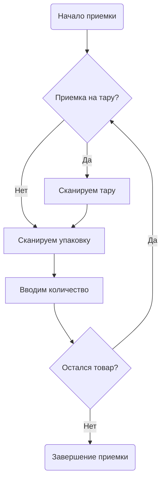

# Markdown

---
Настройка: **File | Settings | Languages & Frameworks | Markdown**
Шаблон имени файла: ***.md** и ***.markdown**
---

[Markdown](https://daringfireball.net/projects/markdown/) - легковесный язык разметки для добавления форматирования
элементов в плоский текст. IntelliJ IDEA по умолчанию включает в себя специальный редактор файлов Markdown,
поддерживающий подсветку синтаксиса, автодополнение и форматирование, а также предпросмотр markdown-файла в отдельной
панели. В настоящее время поддерживается спецификация [CommonMark](https://commonmark.org/).

---

### Включение плагина

Описанный функционал доступен c [плагином Markdown](https://plugins.jetbrains.com/plugin/7793-markdown), который
поставляется установлен и включен по умолчанию. Если соответсвующий функционал не доступен, убедитесь что
[плагин Markdown](https://plugins.jetbrains.com/plugin/7793-markdown) включен.

Для включения плагина:

1. Откройте меню **File | Settings | Plugins** (<kbd>Ctrl</kbd><kbd>Alt</kbd><kbd>S</kbd> + **Plugins**)
2. Откройте вкладку **Installed**, найдите [плагин Markdown](https://plugins.jetbrains.com/plugin/7793-markdown) и
   включите чекбокс возле названия плагина.

---

### Создание нового markdown-файла

По умолчанию IntelliJ IDEA считает markdown-файлом любой файл с расширением **.md** и **.markdown**, поэтому для
добавления markdown-файла в проект достаточно в окне управления проектом (<kbd>Alt</kbd><kbd>1</kbd>) добавить файл 
(<kbd>Alt</kbd><kbd>Insert</kbd>) с расширением **.md** и **.markdown**
---

Встроенный markdown-редактор поддерживает некоторые базовые действия форматирования на [панели форматирования](todo),
которая появляется при выделении текста:


Кроме того редактор поддерживает автодополнение ссылок в рамках текущего проекта. Например:


## Блоки кода

Для вставки блока кода используются тройные обратные апострофы (**\`\`\`**) перед и после блока. После открывающих 
апострофов можно указать язык, на котором написан блок кода. Если язык поддерживается IntelliJ IDEA, то внутри блока 
кода доступны: подсветка синтаксиса, ошибок, автодополнение и, в некоторых случаях, выполнение кода.


```Lsf
MODULE SampleCode;

run() {
    MESSAGE 'Hello World!!!';
}
```

---
### Выключение подсветки ошибок или подсветки синтаксиса

Если в блоке кода не требуется подсветка синтаксиса или подсветка ошибок, то их можно отключить в разделе: **File | 
Settings | Languages & Frameworks | Markdown** (<kbd>Ctrl</kbd><kbd>Alt</kbd><kbd>S</kbd> + **Languages & Frameworks 
| Markdown**)
---

#### Выполнение кода из markdown-файла

Если IntelliJ IDEA определит фрагмент кода как исполняемый, то справа от фрагмента кода появятся иконка запуска:


Таким образом могут быть выполнены, например, **bach** или **shell**
```bash
yarn start
```

## Диаграммы

Редактор markdown может отображать [Mermaid](https://mermaid-js.github.io/) или [PlantUML](https://plantuml.com) 
диаграммы. Этот функционал отключен по умолчанию.

### Mermaid

Для включения поддержки Mermaid-диаграмм нужно установить соответствующий [плагин](https://plugins.jetbrains.com/plugin/20146-mermaid).
Пример диаграммы:



### PlantUML

Установить и включить поддержку PlantUML-диаграмм можно в настройках Settings | Languages & Frameworks | Markdown** 
(<kbd>Ctrl</kbd><kbd>Alt</kbd><kbd>S</kbd> + **Languages & Frameworks | Markdown**)

Пример диаграммы:
```plantuml
Оператор <<Браузер>>
:Кладовщик: as stoker <<Приложение ТСД>>
(Приемка) as (Start) <<Накладная>>
(Приложение) as (Use) <<LSF WMS>>

Оператор -> (Start)
Оператор --> (Use)

stoker --> (Use)
```