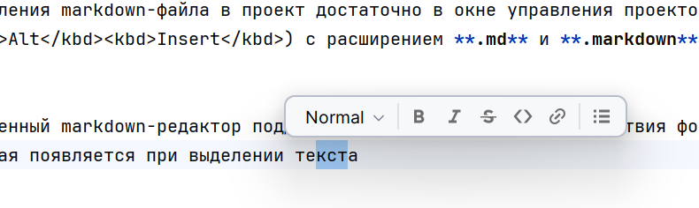
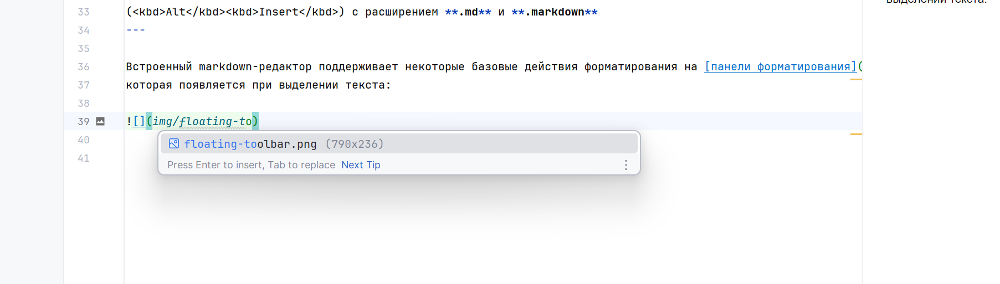
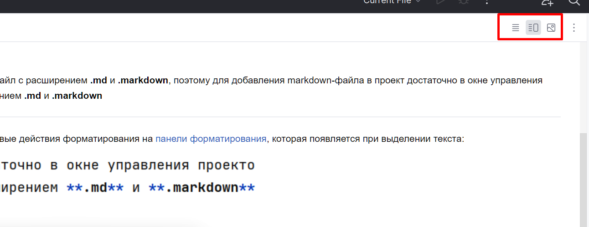
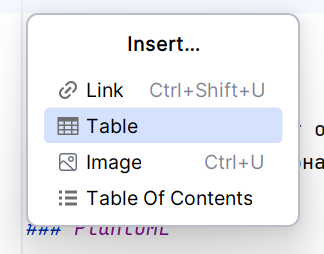
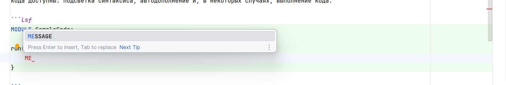
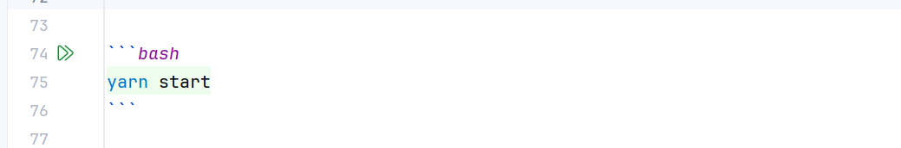
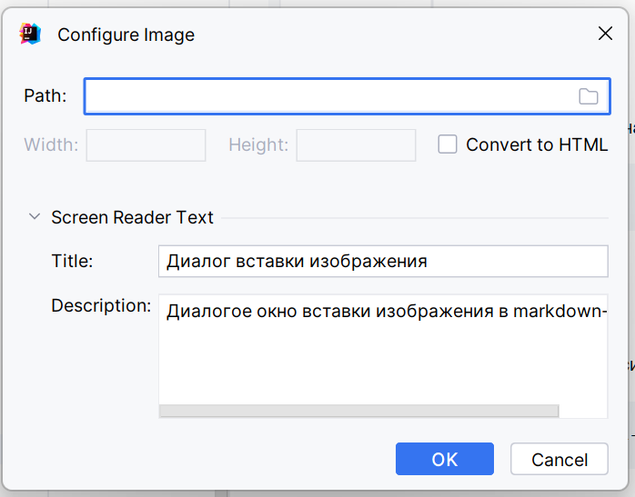
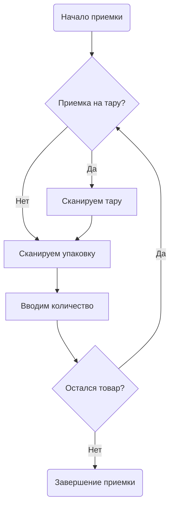

# Markdown

Настройка: **File | Settings | Languages & Frameworks | Markdown**
Шаблон имени файла: ***.md** и ***.markdown**

[Markdown](https://daringfireball.net/projects/markdown/) - легковесный язык разметки для добавления форматирования
элементов в плоский текст. IntelliJ IDEA по умолчанию включает в себя специальный редактор файлов Markdown,
поддерживающий подсветку синтаксиса, автодополнение и форматирование, а также предпросмотр markdown-файла в отдельной
панели. В настоящее время поддерживается спецификация [CommonMark](https://commonmark.org/).

### Включение плагина

Описанный функционал доступен c [плагином Markdown](https://plugins.jetbrains.com/plugin/7793-markdown), который
поставляется установлен и включен по умолчанию. Если соответсвующий функционал не доступен, убедитесь что
[плагин Markdown](https://plugins.jetbrains.com/plugin/7793-markdown) включен.

Для включения плагина:

1. Откройте меню **File | Settings | Plugins** (<kbd>Ctrl</kbd><kbd>Alt</kbd><kbd>S</kbd> + **Plugins**)
2. Откройте вкладку **Installed**, найдите [плагин Markdown](https://plugins.jetbrains.com/plugin/7793-markdown) и
   включите чекбокс возле названия плагина.

### Создание нового markdown-файла

По умолчанию IntelliJ IDEA считает markdown-файлом любой файл с расширением **.md** и **.markdown**, поэтому для
добавления markdown-файла в проект достаточно в окне управления проектом (<kbd>Alt</kbd><kbd>1</kbd>) добавить файл
(<kbd>Alt</kbd><kbd>Insert</kbd>) с расширением **.md** и **.markdown**

Встроенный markdown-редактор поддерживает некоторые базовые действия форматирования на панели форматирования, которая
появляется при выделении текста:



Настроить панель форматирования можно в меню **Settings | Appearance & Behavior | Menus and Toolbars**
Включить или отключить панель форматирования можно в меню **Settings | Advanced Settings**

Кроме того редактор поддерживает автодополнение ссылок в рамках текущего проекта. Например:



## Превью

По умолчанию редактор показывает панель превью рядом с исходным текстом markdown. Для переключения режима превью можно
использовать кнопки в правом верхнем углу окна:



Настройки, используемые по умолчанию для превью можно задать **Settings | Languages & Frameworks | Markdown**

## Таблицы

IntelliJ IDEA поддерживает создание и редактирования таблиц.

### Вставка таблицы

1. Нажмите <kbd>Alt</kbd><kbd>Insert</kbd> для открытия всплывающего меню вставки и выберите **Table**
   

2. Выберите размер таблицы
3. Вводите содержимое таблицы в каждую ячейку и нажимайте <kbd>Tab</kbd> для перемещения курсора в следующую ячейку. Для
   добавления новой строки нажмите <kbd>Shift</kbd><kbd>Enter</kbd>. IntelliJ IDEA автоматически выравнивает строки и
   столбцы по содержимому ячеек.

IntelliJ IDEA highlights подсвечивает таблицы с некорректным форматированием и предлагает исправить их. Когда вы
выбираете **Reformat table** из списка опций, IntelliJ IDEA показывает превью ожидаемого результата.

| Один | Два | Три |
|::|:--|--|
| Каждый | Охотник | Желает |
| Знать | Где | Сидит |
| Фазан | | |

По умолчанию IntelliJ IDEA отображает маркеры столбцов и строк в редакторе. Используйте левый клик по маркеру для
выбора, перемещения, вставки, удаления и выравнивания строк и столбцов. Маркеры - это специальный вид inlay hints,
специфичный для markdown-файлов. Следовательно, включить или выключить эти маркеры можно в настройках **File |
Settings | Editor | Inlay Hints | Markdown | Table inlays**.

## Блоки кода

Для вставки блока кода используются тройные обратные апострофы (**\`\`\`**) перед и после блока. После открывающих
апострофов можно указать язык, на котором написан блок кода. Если язык поддерживается IntelliJ IDEA, то внутри блока
кода доступны: подсветка синтаксиса, ошибок, автодополнение и, в некоторых случаях, выполнение кода.



```Lsf
MODULE SampleCode;

run() {
    MESSAGE 'Hello World!!!';
}
```

### Выключение подсветки ошибок или подсветки синтаксиса

Если в блоке кода не требуется подсветка синтаксиса или подсветка ошибок, то их можно отключить в разделе: **File |
Settings | Languages & Frameworks | Markdown** (<kbd>Ctrl</kbd><kbd>Alt</kbd><kbd>S</kbd> + **Languages & Frameworks |
Markdown**)

#### Выполнение кода из markdown-файла

Если IntelliJ IDEA определит фрагмент кода как исполняемый, то справа от фрагмента кода появятся иконка запуска:



Таким образом могут быть выполнены, например, **bach** или **shell**

```bash
yarn start
```

## Изображения

По умолчанию в markdown используется следующий синтаксис для изображений:

```

```

Вставить изображение можно из меню вставки (<kbd>Alt</kbd><kbd>Insert</kbd>) или с помощью сочетания клавиш
<kbd>Ctrl</kbd><kbd>U</kbd>. В таком случае откроется диалоговое окно:



Если в буфере обмена находится изображение, то при вставке из буфера обмена файл добавится в проект, а ссылка на него
вставится в markdown-файл.

Открыть диалог редактирования изображения можно кликнув на значок справа.

## Ссылка

По умолчанию в markdown используется следующий синтаксис для ссылок:

```

```

### Вставка ссылки

Вставить ссылку можно из меню вставки (<kbd>Alt</kbd><kbd>Insert</kbd>) или с помощью сочетания клавиш
<kbd>Ctrl</kbd><kbd>Shift</kbd><kbd>U</kbd>. Если при этом какой-то текст был выделен, то он будет заключен в квадратные
скобки `[]`, а если в буфере обмена находился URL, он будет заключен в круглые скобки `()`.

### Ссылка на другой файл или на заголовок

Наряду URL вы можете вставлять ссылки на любой заголовок в текущем файле:

```
# Это раздел

Ссылка на [раздел](#это-раздел)
```

Также вы можете вставлять ссылки и на раздел другого файла из текущего проекта:

```
# Это раздел

Ссылка на [раздел в другом файле](another-file.md#это-раздел-в-другом-файле)
```

IntelliJ IDEA поддерживает автодополнение ссылок в текущем контексте, переход по ссылке по клику с нажатой клавишей
<kbd>Ctrl</kbd>, переименование при рефакторинге по <kbd>Shift</kbd><kbd>F6</kbd> как на заголовке, так и на ссылке, а
также поиск использование по <kbd>Alt</kbd><kbd>F7</kbd> как на заголовке, так и на ссылке.

### Содержание файла

На основании заголовков с помощью меню вставки (<kbd>Alt</kbd><kbd>Insert</kbd>) вы можете сгенерировать, а затем
обновлять содержание файла. При этом содержание будет заключено в теги `<!-- TOC -->`

## Диаграммы

Редактор markdown может отображать [Mermaid](https://mermaid-js.github.io/) или [PlantUML](https://plantuml.com)
диаграммы. Этот функционал отключен по умолчанию.

### PlantUML

Установить и включить поддержку PlantUML-диаграмм можно в настройках Settings | Languages & Frameworks | Markdown**
(<kbd>Ctrl</kbd><kbd>Alt</kbd><kbd>S</kbd> + **Languages & Frameworks | Markdown**)

Пример диаграммы:

```plantuml
Оператор <<Браузер>>
:Кладовщик: as stoker <<Приложение ТСД>>
(Приемка) as (Start) <<Накладная>>
(Приложение) as (Use) <<LSF WMS>>

Оператор -> (Start)
Оператор --> (Use)

stoker --> (Use)
```

### Mermaid

Для включения поддержки Mermaid-диаграмм нужно установить
соответствующий [плагин](https://plugins.jetbrains.com/plugin/20146-mermaid). Пример диаграммы:



## Реформат файлов

Встроенный бьютифаер IntelliJ IDEA поддерживает реформатирование md-файлов в соответствии с настройками переноса строк,
пустых строк и отступов. Вы можете включить реформат файла при коммите (**File | Settings | Version Control | Commit**)
или в любой момент выполнить его вручную с помощью сочетания клавиш <kbd>Ctrl</kbd><kbd>Alt</kbd><kbd>L</kbd>
(<kbd>Ctrl</kbd><kbd>Shift</kbd><kbd>Alt</kbd><kbd>L</kbd>)

### Настройка форматирования

Настроить форматирование файлов можно в (**File | Editor | Code Style | Markdown**)

